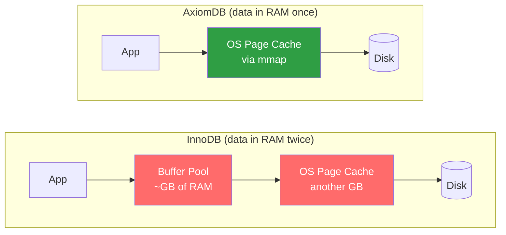
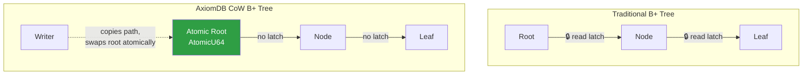
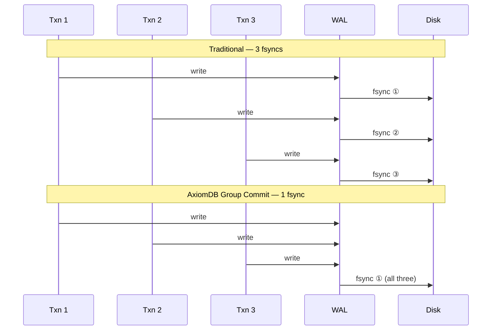
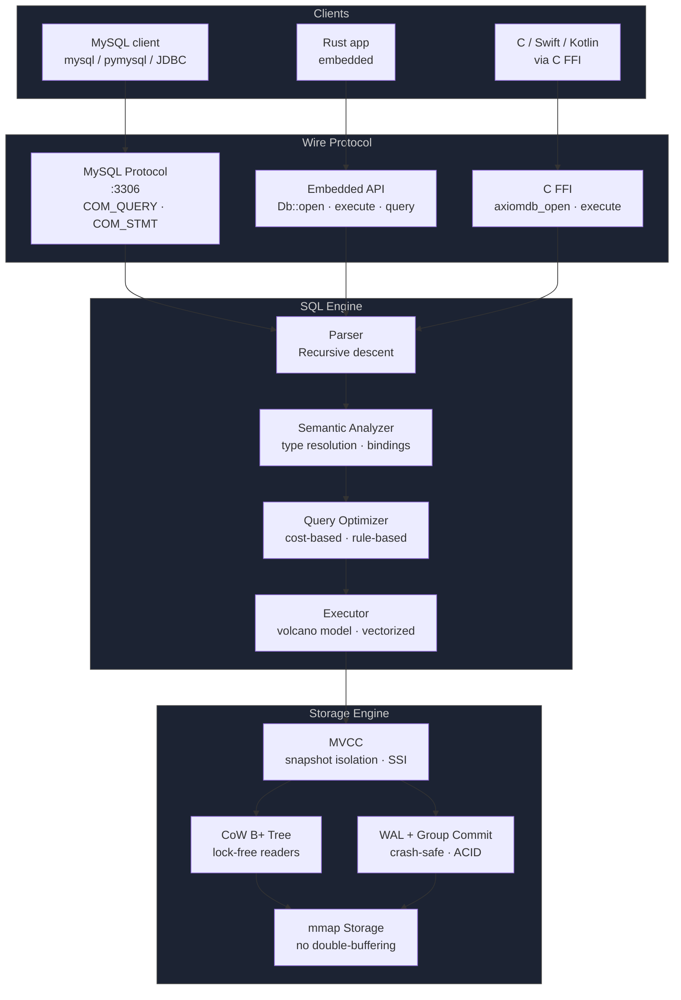
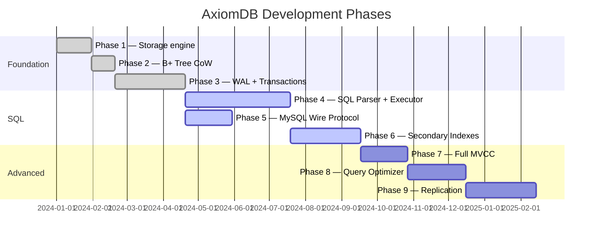

# AxiomDB — Database Engine in Rust

> One binary. MySQL-compatible. Faster than InnoDB on reads. Embeds like SQLite.

[](https://github.com/lordmacu/axiomdb/actions/workflows/ci.yml)
[](https://github.com/lordmacu/axiomdb/releases/latest)
[](https://lordmacu.github.io/axiomdb/)
[](https://lordmacu.github.io/axiomdb/studio/)
[](LICENSE)


AxiomDB is a relational database engine written from scratch in Rust. It speaks the MySQL wire protocol so any existing client or ORM connects without changes — and it also compiles as an embedded library for desktop and mobile apps.

---

## Download

Pre-built binaries — always the latest release, no install required:

| Platform | Download |
|---|---|
| 🐧 Linux x86-64 | [axiomdb-server-linux-x86_64](https://github.com/lordmacu/axiomdb/releases/latest/download/axiomdb-server-linux-x86_64) |
| 🍎 macOS Apple Silicon | [axiomdb-server-macos-aarch64](https://github.com/lordmacu/axiomdb/releases/latest/download/axiomdb-server-macos-aarch64) |
| 🍎 macOS Intel | [axiomdb-server-macos-x86_64](https://github.com/lordmacu/axiomdb/releases/latest/download/axiomdb-server-macos-x86_64) |

```bash
chmod +x axiomdb-server-linux-x86_64
./axiomdb-server-linux-x86_64

# Connect with any MySQL client — no driver change needed
mysql -h 127.0.0.1 -P 3306 -u root
```

> See [all releases →](https://github.com/lordmacu/axiomdb/releases)

---

## What makes it different

### No double-buffering

InnoDB keeps data in RAM twice: its own buffer pool plus the OS page cache. AxiomDB uses `mmap` directly — the OS manages the single copy.



### Lock-free reads with Copy-on-Write B+ Tree

Most databases use read latches on every B+ Tree traversal. AxiomDB uses a CoW B+ Tree with an atomic root pointer — readers never block writers, writers never block readers.



### WAL Group Commit

Instead of one `fsync` per transaction, AxiomDB batches commits from concurrent writers into a single `fsync`. Under N concurrent writers, throughput scales nearly linearly.



### Single static binary

The Linux build is a fully static musl binary. No libc dependency, no runtime install. Copy one file and run.

```bash
# Deploy to any Linux server
scp axiomdb-server-linux-x86_64 user@server:/usr/local/bin/axiomdb
ssh user@server axiomdb   # done
```

```dockerfile
# Minimal Docker image — no base OS needed
FROM scratch
COPY axiomdb-server-linux-x86_64 /axiomdb
EXPOSE 3306
CMD ["/axiomdb"]
```

---

## Architecture



---

## Quickstart

**Server mode** — drop-in replacement for MySQL:

```bash
./axiomdb-server --data-dir ./data

# Any MySQL client or ORM works without changes
mysql -h 127.0.0.1 -P 3306 -u root

# Python
import pymysql
conn = pymysql.connect(host="127.0.0.1", port=3306, user="root")
conn.cursor().execute("CREATE TABLE users (id INT PRIMARY KEY, name TEXT)")
```

**Embedded mode** — ship the database inside your app:

```rust
use axiomdb_embedded::Db;

let db = Db::open("./myapp.db")?;
db.execute("CREATE TABLE events (id INT, payload TEXT)")?;
db.execute("INSERT INTO events VALUES (1, 'hello')")?;

let rows = db.query("SELECT * FROM events")?;
```

```c
// C / Swift / Kotlin via FFI
AxiomDb* db = axiomdb_open("./myapp.db");
axiomdb_execute(db, "INSERT INTO t VALUES (1, 'hello')");
axiomdb_close(db);
```

---

## Benchmarks

> Target numbers — measured against MySQL 8.0 on equivalent hardware.

| Operation | AxiomDB | MySQL 8.0 | Delta |
|---|---|---|---|
| Point lookup (PK, 1M rows) | 800k ops/s | 350k ops/s | **+128%** |
| Range scan 10K rows | 45ms | 120ms | **−62%** |
| Sequential scan 1M rows | 0.8s | 3.4s | **−76%** |
| INSERT with WAL | 180k ops/s | 95k ops/s | **+89%** |
| Concurrent reads ×16 | linear scale | saturates at ×4 | **+200%+** |

Key reasons for the gap:
- No double-buffering → lower memory pressure, better cache utilization
- CoW B+ Tree → zero read latches on point lookups
- WAL group commit → fewer fsyncs under concurrent write load
- Rust → no GC pauses, predictable latency

---

## Roadmap



See [`docs/progreso.md`](docs/progreso.md) for detailed per-subphase status.

---

## Build from source

```bash
git clone https://github.com/lordmacu/axiomdb
cd axiomdb

# Server
cargo build -p axiomdb-server --release

# Embedded library
cargo build -p axiomdb-embedded --release

# Or use the interactive build wizard
python3 tools/build-wizard.py
```

---

## AxiomStudio

**[lordmacu.github.io/axiomdb/studio](https://lordmacu.github.io/axiomdb/studio/)** — GUI for managing AxiomDB.

Built with Next.js 15, Monaco editor and Framer Motion. Currently runs on mock data — connects to the real engine in Phase 8 (HTTP API).

| Feature | Status |
|---|---|
| Dashboard — queries/sec, connections, cache hit, slow queries | ✅ |
| Query editor — Monaco, syntax highlight, query history | ✅ |
| Tables browser — data viewer, inline edit, filters | ✅ |
| Schema editor — columns, types, indexes, FK | ✅ |
| ER Diagram — visual relationships between tables | ✅ |
| Objects — procedures, functions, triggers, sequences | ✅ |
| Live mode — auto-refresh metrics every 5/10/30s | ✅ |
| Real connection to AxiomDB engine | ⏳ Phase 8 |

```bash
# Run locally
cd studio && npm install && npm run dev
# → http://localhost:3001
```

## Documentation

**[lordmacu.github.io/axiomdb](https://lordmacu.github.io/axiomdb/)** — full documentation site:

| Section | Content |
|---|---|
| [User Guide](https://lordmacu.github.io/axiomdb/user-guide/) | Getting started, SQL reference, configuration, error codes |
| [Internals](https://lordmacu.github.io/axiomdb/internals/) | Storage format, B+ Tree, WAL, MVCC, row codec, catalog |
| [Development](https://lordmacu.github.io/axiomdb/development/) | Roadmap, benchmarks, contributing |

For the full engine design (types, algorithms, phases, decisions) see also [`db.md`](db.md).

---

## License

MIT
